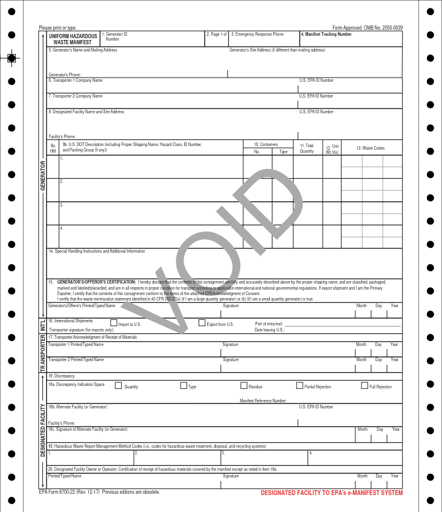

# The Manifest

The Uniform Hazardous Waste Manifest (AKA "manifest" or EPA form 8700-22) is form required by EPA for all hazardous waste generators who transport hazardous waste for off-site treatment, recycling, storage or disposal.
It is also commonly used to satify and U.S. Department of Transportation (DOT) requirements.
When completed, the form contains information on the type and quantity of the waste being transported, instructions for handling the waste, and signature lines

## Paper Manifests

Since the inception of the uniform manifest, the manifesting process was completed on
[NCR paper](https://www.google.com/search?client=firefox-b-1-d&q=NCR+paper#ip=1) often refered to
as carbon-copy paper. e-Manifest collects these manifest in addition to managing electronic manifests.
With paper manifests, once the waste reaches its destination, the designated receiving facility returns one of the signed copies to the generator, and submits one to the e-Manifest system using one of
[the available submission methods](https://www.epa.gov/e-manifest/how-submit-hazardous-waste-manifest)

Only [registered manifest printers](https://www.epa.gov/hwgenerators/hazardous-waste-manifest-system#printer) can print paper manifest. You can print paper copies of electronic manifest from the e-Manifest system for Hybrid manifests and to carry onboard with the transporter for DOT purposes. EPA established this procedure, in part, to ensure that each manifest has a unique identifying string called the Manifest Tracking Number (MTN) in box 4.

All paper manifests that accompany waste that requires manifesting (whether the waste is federally regualted or state regualted in the generatoring or receiving state) must be submitted to the e-Manifest system by the designated receving facility. The Receiving facility is required to pay a fee, the amount depends on the submission type and the current e-Manifest fees.

## Electronic Manifests

An Electronic manifest is the electronic format of the uniform hazardous waste manifest obtained and completed through the e-Manifest system. It is the legal equivalent. At the time of writing, all electronic manifest use the letters "ELC" as the suffix to their manifest tracking number.

### Electronic vs Paper Manifest Content

The electronic manifest generally contains the same informaion as its paper counterpart, however there are a few key differences.

#### Physical Space

The electronic manifest is not constrained by the available physical space on a piece of paper.

1. **Waste Codes**: Generators are required to enter up to six (6) waste codes to describe each waste stream. State waste codes that are not redundant with federal codes must be entered here, in addition to the federal waste codes which are most representative of the properties of the waste. For more inforation, see the [Instructions for completing the hazardous waste manifest](https://www.epa.gov/hwgenerators/uniform-hazardous-waste-manifest-instructions-sample-form-and-continuation-sheet). Electronic manifest are not constrained by space, all applicable waste codes can be entered for the applicable waste stream.

2. \*\*

#### Additional Fields

The electronic manifest also contains additional fields that the paper manifest does not. As the e-Manifest continues to be developed, additional fields that benefit the e-Manifest stakeholders and EPA may be added.

## More Information

For more information on the uniform hazardous waste manifest and updates on the e-Manifest syste, visit
<https://www.epa.gov/e-manifest>

- [The paper manifest](https://www.epa.gov/hwgenerators/hazardous-waste-manifest-system)
  - [Instructions for completing the hazardous waste manifest](https://www.epa.gov/hwgenerators/uniform-hazardous-waste-manifest-instructions-sample-form-and-continuation-sheet)
  - [Paper manifest submission options](https://www.epa.gov/e-manifest/how-submit-hazardous-waste-manifest)
  - [e-Manifest submission Fees](https://www.epa.gov/e-manifest/e-manifest-user-fees-and-payment-information)
- [Terminology](terminology.md)
