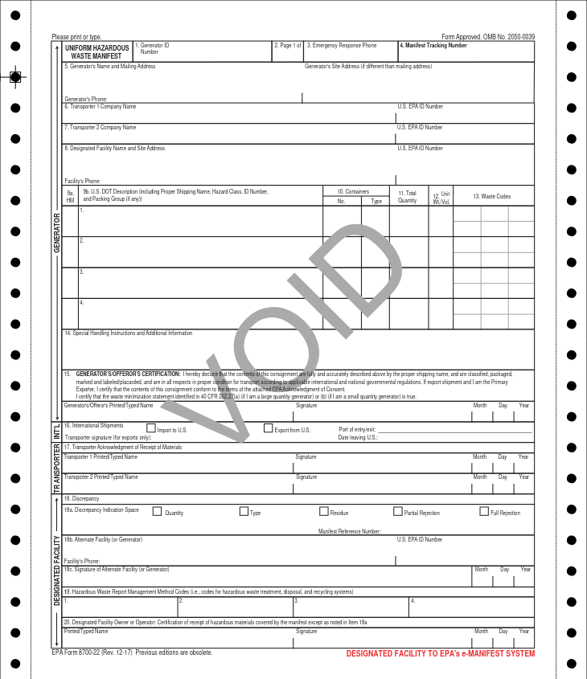
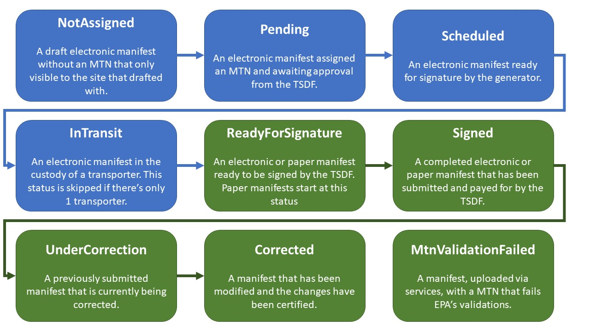

# The Manifest

The Uniform Hazardous Waste Manifest (AKA "manifest" or EPA form 8700-22) is a form required by EPA for all hazardous
waste [generators](terminology.md#generator) who [transport](terminology.md#transporter) hazardous waste for
off-site [treatment, recycling, storage or disposal (TSD)](terminology.md#treatment-storage-or-disposal-facility-tsdf--receiving-facility--designated-facility).
It is also commonly used to satisfy and U.S. Department of Transportation (DOT) requirements. When completed, the form
contains information on the type and quantity of the waste being transported, instructions for handling the waste, and
signature lines

## Paper Manifests

Historically, the manifesting process was completed
on [NCR paper](https://www.google.com/search?client=firefox-b-1-d&q=NCR+paper#ip=1) often referred to
as carbon-copy paper. When the waste reaches its destination, the designated receiving facility submits the paper
manifest to the e-Manifest system using one of
[the available submission methods](https://www.epa.gov/e-manifest/how-submit-hazardous-waste-manifest)



Only [registered manifest printers](https://www.epa.gov/hwgenerators/hazardous-waste-manifest-system#printer) can print
paper manifest. You can print paper copies of electronic and hybrid manifest from the e-Manifest system to carry onboard
with the transporter for DOT purposes. EPA established this procedure, in part, to ensure that each manifest has a
unique identifying string called the Manifest Tracking Number (MTN) in box 4.

## Electronic Manifests

An Electronic manifest is the electronic format of the uniform hazardous waste manifest obtained and completed through
the e-Manifest system. It is the legal equivalent. At the time of writing, all electronic manifest use the letters "ELC"
as the suffix to their manifest tracking number.

Arguably the easiest way to visualize an electronic manifest is [JSON](https://www.json.org/json-en.html) encoded.

<details>

   <summary style="font-size: 18px; font-weight: bold">
      Click to see example JSON encoded electronic manifest
   </summary>

```json
{
  "createdDate": "2021-10-20T15:12:35.046+00:00",
  "updatedDate": "2023-06-01T18:26:52.793+00:00",
  "manifestTrackingNumber": "100032713ELC",
  "status": "Signed",
  "discrepancy": false,
  "submissionType": "FullElectronic",
  "originType": "Service",
  "shippedDate": "2023-02-10T05:42:05.246+00:00",
  "receivedDate": "2023-06-01T18:21:18.642+00:00",
  "generator": {
    "epaSiteId": "VATESTGEN001",
    "name": "VA TEST GEN 2021",
    "modified": true,
    "registered": true,
    "mailingAddress": {
      "address1": "123 VA TEST GEN 2021 WAY",
      "city": "ARLINGTON",
      "state": {
        "code": "VA",
        "name": "VIRGINIA"
      },
      "country": {
        "code": "US",
        "name": "UNITED STATES"
      },
      "zip": "22202"
    },
    "siteAddress": {
      "address1": "123 VA TEST GEN 2021 WAY",
      "city": "ARLINGTON",
      "state": {
        "code": "VA",
        "name": "VIRGINIA"
      },
      "country": {
        "code": "US",
        "name": "UNITED STATES"
      },
      "zip": "22202"
    },
    "contact": {
      "phone": {
        "number": "555-555-5555"
      },
      "email": "Testing@EPA.GOV"
    },
    "emergencyPhone": {
      "number": "888-888-8888"
    },
    "electronicSignaturesInfo": [
      {
        "humanReadableDocument": {
          "name": "human-readable.html",
          "size": 174777,
          "mimeType": "TEXT_HTML"
        }
      }
    ],
    "gisPrimary": false,
    "canEsign": true,
    "limitedEsign": true,
    "hasRegisteredEmanifestUser": true
  },
  "transporters": [
    {
      "epaSiteId": "VATESTRAN02",
      "name": "VA TEST TRAN 2021",
      "modified": true,
      "registered": true,
      "mailingAddress": {
        "address1": "321 VA TEST TRAN 2021 ROAD",
        "city": "ARLINGTON",
        "state": {
          "code": "VA",
          "name": "VIRGINIA"
        },
        "country": {
          "code": "US",
          "name": "UNITED STATES"
        },
        "zip": "22202"
      },
      "siteAddress": {
        "address1": "321 VA TEST TRAN 2021 ROAD",
        "city": "ARLINGTON",
        "state": {
          "code": "VA",
          "name": "VIRGINIA"
        },
        "country": {
          "code": "US",
          "name": "UNITED STATES"
        },
        "zip": "22202"
      },
      "contact": {
        "phone": {
          "number": "888-999-8888"
        }
      },
      "electronicSignaturesInfo": [
        {
          "signer": {
            "firstName": "John",
            "lastName": "Doe",
            "userId": "jdoe12345"
          },
          "signatureDate": "2023-02-10T05:42:05.246+00:00",
          "humanReadableDocument": {
            "name": "human-readable.html",
            "size": 181426,
            "mimeType": "TEXT_HTML"
          },
          "signerRole": "Industry",
          "signatureMethod": "QuickerSign"
        }
      ],
      "gisPrimary": false,
      "canEsign": true,
      "limitedEsign": true,
      "hasRegisteredEmanifestUser": true,
      "order": 1
    }
  ],
  "designatedFacility": {
    "epaSiteId": "VATESTTSDF03",
    "name": "VA TEST TSDF 2021",
    "modified": true,
    "registered": true,
    "mailingAddress": {
      "address1": "234 VA TEST TSDF 2021 DRIVE",
      "city": "ARLINGTON",
      "state": {
        "code": "VA",
        "name": "VIRGINIA"
      },
      "country": {
        "code": "US",
        "name": "UNITED STATES"
      },
      "zip": "22202"
    },
    "siteAddress": {
      "address1": "234 VA TEST TSDF 2021 DRIVE",
      "city": "ARLINGTON",
      "state": {
        "code": "VA",
        "name": "VIRGINIA"
      },
      "country": {
        "code": "US",
        "name": "UNITED STATES"
      },
      "zip": "22202"
    },
    "contact": {
      "phone": {
        "number": "555-555-5555"
      },
      "email": "Testing@EPA.GOV"
    },
    "electronicSignaturesInfo": [
      {
        "signer": {
          "firstName": "Jane",
          "lastName": "foo",
          "userId": "janefoo12345"
        },
        "signatureDate": "2023-06-01T18:21:18.642+00:00",
        "humanReadableDocument": {
          "name": "human-readable.html",
          "size": 179135,
          "mimeType": "TEXT_HTML"
        },
        "signerRole": "Industry",
        "signatureMethod": "QuickSign"
      },
      {
        "humanReadableDocument": {
          "name": "human-readable.html",
          "size": 179162,
          "mimeType": "TEXT_HTML"
        }
      }
    ],
    "gisPrimary": false,
    "canEsign": true,
    "limitedEsign": true,
    "hasRegisteredEmanifestUser": true
  },
  "wastes": [
    {
      "dotHazardous": true,
      "dotInformation": {
        "idNumber": {
          "code": "NA1993"
        },
        "printedDotInformation": "NA1993, Waste Diesel fuel, 3, III"
      },
      "quantity": {
        "containerNumber": 13,
        "containerType": {
          "code": "DM",
          "description": "Metal drums, barrels, kegs"
        },
        "quantity": 481,
        "unitOfMeasurement": {
          "code": "G",
          "description": "Gallons"
        }
      },
      "hazardousWaste": {
        "federalWasteCodes": [
          {
            "code": "D001",
            "description": "IGNITABLE WASTE"
          }
        ],
        "tsdfStateWasteCodes": [],
        "generatorStateWasteCodes": []
      },
      "additionalInfo": {
        "comments": [
          {
            "label": "Profile #",
            "description": "E654321",
            "handlerId": "VATESTRAN02"
          }
        ],
        "handlingInstructions": "This Manifest is for testing purposes and does not match reality it's more to show what you can do."
      },
      "lineNumber": 1,
      "br": false,
      "managementMethod": {
        "code": "H040",
        "description": "INCINERATION"
      },
      "pcb": false,
      "discrepancyResidueInfo": {
        "wasteQuantity": false,
        "wasteType": false,
        "residue": false
      },
      "epaWaste": true
    },
    {
      "dotHazardous": false,
      "wasteDescription": "PCB contaminated bags",
      "quantity": {
        "containerNumber": 12,
        "containerType": {
          "code": "BA",
          "description": "Burlap, cloth, paper, or plastic bags"
        },
        "quantity": 132,
        "unitOfMeasurement": {
          "code": "K",
          "description": "Kilograms"
        }
      },
      "hazardousWaste": {
        "federalWasteCodes": [],
        "tsdfStateWasteCodes": [],
        "generatorStateWasteCodes": []
      },
      "additionalInfo": {
        "handlingInstructions": "This Manifest is for testing purposes and does not match reality it's more to show what you can do."
      },
      "lineNumber": 2,
      "br": false,
      "managementMethod": {
        "code": "H040",
        "description": "INCINERATION"
      },
      "pcb": true,
      "pcbInfos": [
        {
          "loadType": {
            "code": "BulkWaste"
          },
          "dateOfRemoval": "2018-04-18T16:00:00.000+00:00",
          "weight": 432,
          "bulkIdentity": "Bulk Waste ID2"
        },
        {
          "loadType": {
            "code": "BulkWaste"
          },
          "dateOfRemoval": "2018-03-18T16:00:00.000+00:00",
          "weight": 432,
          "bulkIdentity": "Bulk Waste ID"
        }
      ],
      "discrepancyResidueInfo": {
        "wasteQuantity": false,
        "wasteType": false,
        "residue": false
      },
      "epaWaste": false
    }
  ],
  "additionalInfo": {
    "handlingInstructions": "On the Manifest level. This Manifest is for testing purposes and does not match reality it's more to show what you can do."
  },
  "rejection": false,
  "residue": false,
  "import": false,
  "containsPreviousRejectOrResidue": false,
  "correctionInfo": {
    "active": true
  }
}
```

</details>

### Electronic vs Paper Manifest Content

Electronic manifests generally contain the same information as their paper counterparts, however electronic manifests
are not constrained by the physical space available on a piece of paper. This allows for additional information to be
included on the electronic manifest that is not available on the paper manifest during shipment. However, the paper
manifest can be supplemented with much of this material when it is submitted to the e-Manifest system.

#### one-to-many relationships

1. **Waste Codes**: A waste stream can have many applicable waste codes. On paper manifests, generators are
   required to enter up to six (6) waste codes to describe each waste stream (
   see [Instructions for completing the hazardous waste manifest](https://www.epa.gov/hwgenerators/uniform-hazardous-waste-manifest-instructions-sample-form-and-continuation-sheet)).
   Electronic manifest are not constrained by space, all applicable waste codes can be entered for the applicable waste
   line.

2. **Transporters**: A manifest can have one or more transporters. Paper manifests have space for up to three (3)
   transporters before a continuation sheet must be used. When more than three transporters are listed on an electronic
   manifest, the e-Manifest system will automatically generate a continuation sheet if the electronic manifest needs to
   be printed.

#### Additional Fields

As e-Manifest continues to be developed, additional fields that benefit the e-Manifest stakeholders and EPA may be
added.

1. **Biennial Report**: the `"BrInfo"` field contains data related to
   the [Biennial Report](https://www.epa.gov/hwgenerators/biennial-hazardous-waste-report). Users can elect to provide
   this information on the manifest, RCRAInfo can make use of this data in the BR module to make reporting easier for
   users who elect to provide this information.

#### Field Values

1. **status**: The status field of electronic manifests is managed by the e-Manifest system. Since paper
   manifests are completed outside the e-Manifest system and uploaded after the TSDF receives the shipment, paper
   manifests can only be assigned a subsection of the available statuses.

   
   _Green boxes are shared by electronic/hybrid and paper manifests._

2. **Codes**: Items such as waste codes, management method codes, units of measurements and others have a different
   representation on electronic manifests than on paper manifests. For example, a federal waste codes
   paper manifests are usually represented by a single string containing a single letter and three
   numbers, such as `'D001'`. The same federal waste code on an electronic manifest, would be represented by an object
   containing the code and a description.

   ```json
   {
     "code": "D001",
     "description": "IGNITABLE WASTE"
   }
   ```

## More Information

- [The paper manifest](https://www.epa.gov/hwgenerators/hazardous-waste-manifest-system)
  - [Instructions for completing the hazardous waste manifest](https://www.epa.gov/hwgenerators/uniform-hazardous-waste-manifest-instructions-sample-form-and-continuation-sheet)
  - [Paper manifest submission options](https://www.epa.gov/e-manifest/how-submit-hazardous-waste-manifest)
  - [e-Manifest submission Fees](https://www.epa.gov/e-manifest/e-manifest-user-fees-and-payment-information)
- [Terminology](terminology.md)

{{#include ../components/footer.md}}
